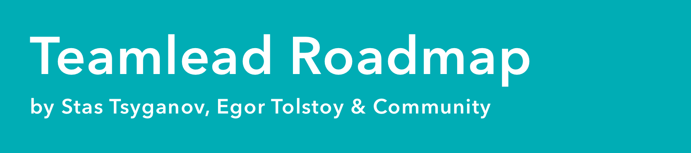

> Тимлид – это ❄️, потому что в каждой компании он уникален и неповторим.
[Teamlead Roadmap](https://tlroadmap.io) – это карта навыков и компетенций тимлидов, которую можно адаптировать для любой компании и команды. Попробуйте приложить её и к себе!

- [Сайт с базой знаний](https://tlroadmap.io)
- [Telegram-чат проекта](https://tlinks.run/tlbootcamp)

# Work in progress
Текущий роадмап – не финальный, база знаний продолжает наполняться, а структура веток периодически обновляется. Мы будем очень рады вашему участию в проекте – не стесняйтесь публиковать Issue, закидывать свои pull request и присоединяться к обсуждению [в Telegram-чате](https://tlinks.run/tlbootcamp). Если вы готовы помочь и поделиться своим опытом – прочитайте [инструкцию по быстрому старту](https://tlroadmap.io/contributing.html).

# Лицензия
Мы используем [лицензию Creative Commons Attribution-ShareAlike 4.0](https://tlroadmap.io/license.html). Если кратко, вы можете свободно:
- **Делиться (обмениваться)** — копировать и распространять материал на любом носителе и в любом формате.
- **Адаптировать (создавать производные материалы)** — делать ремиксы, видоизменять, и создавать новое, опираясь на этот материал в любых целях, включая коммерческие.

При соблюдении следующих условий:
- Вы должны обеспечить соответствующее **указание авторства**, предоставить ссылку на лицензию, и обозначить изменения, если таковые были сделаны.
- Если вы перерабатываете, преобразовываете материал или берёте его за основу для производного произведения, вы должны распространять переделанные вами части материала **на условиях той же лицензии**, в соответствии с которой распространяется оригинал.
