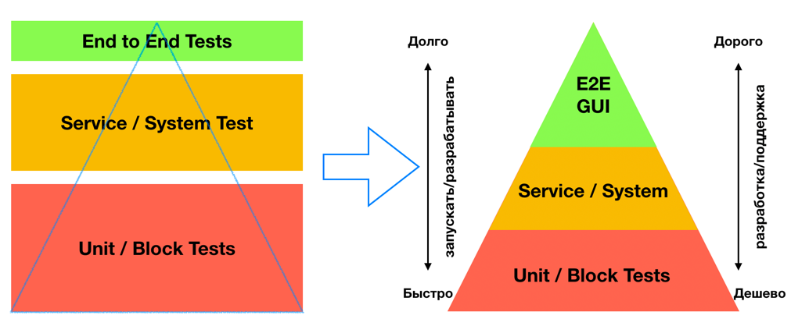

# Пирамида тестирования
## Описание
Пирамида тестирования — один из способов обеспечения качества ПО, визуализация, которая помогает группировать тесты по типу их назначения. Так же, позволяет согласовать правила написания тестов, разделения их на типы, обозначить основной фокус тестирования в каждой из групп.

Цель использования данного процесса:
- Экономия времени и ресурсов в процессах обеспечения качества
- Сократить количество сложных кейсов тестирования
- Группировка и типизация тестов
- Снижение рисков возникновения критических дефектов ПО
- Формализация тех. долга в части QA
- Формализация правил написания тестов
- Формализация требований к кодовой базе: code coverage, тестовые планы
- Автоматизация рутинных и частых операций
- Чётко-регламентированная изоляция ресурсов в зависимости от вида тестирования

## Почему ветка важна?
Для менеджера:
- Увеличение скорости разработки в среднесрочной перспективе
- Сдвиг этапа обнаружения дефектов на более ранние стадии разработки
- Позволяет варьировать затраты на инфраструктуру, время разработки в зависимости от требуемого качества
- Возможность формализовать требования к тестированию ПО, соотношения ручных/автоматических тестов

Для разработчика:
- Безболезненный red/green refactoring
- Совместим практически со всеми практиками разработки ПО: TDD/BDD/DDD etc.
- Позволяет экономить время на запуск тестов
- В связке с практиками CI/CD позволяет быстро определять работоспособность критически важных фич
- Помогает предотвратить [каскадные ошибки](https://en.wikipedia.org/wiki/Cascading_failure#Cascading_failure_in_power_transmission)
- Снижает уровень связанности кода, улучшает модульность, помогает формализовать API модульного/сервисного взаимодействия

Для тестировщика:
- Небольшие изменения могут попадать в production без ручного тестирования
  - экономия времени тестировщиков
  - минимизация человеческого фактора на рутинных операциях
  - оптимизация time to market
- задачи в тестирование поступают хорошего качества
  - реже возникают ошибки из-за невнимательности
  - меньше циклов доработки-тестирования
  - тестировщик не вынужден тестировать одну и ту же фичу несколько раз
- простые ошибки выявляются тестами на ранних стадиях
  - отдел QA занимается более сложными кейсами тестирования
  - меньше тестировщиков могут обеспечивать такое же качество ПО
- количество GUI-тестов, как правило меньше
  - их проще поддерживать
  - тестируется только критическая функциональность, которая не был протестирована другими группами автотестов

## Что будет, если её не делать?

- Увеличится среднее время обнаружения дефекта
  - Больше дефектов будет попадать в контуры промышленной эксплуатации (production)
  - Нестабильные релизы
  - Неконтролируемый тех. долг/лавинообразный рост багов даже при минорных изменениях

- Возрастут затраты на ручное тестирование
  - Рутина составления тест. планов
  - Возрастёт штат ручного тестирования
  - Нет чёткой структуры тестов

- Каждое изменение кодовой базы может требовать полный регресс тестирования всего модуля

## На кого может быть делегирована?
Распространённая практика: разные группы тестов делегировать разным группам людей. Например модульные и интеграционные тесты могут быть отданы разработчикам, а end-to-end тесты и ручные тесты в отдел Quality Assurance.

## Примеры поведения
### Примеры плохого поведения
- Пользоваться моделью рожка мороженого (перевёрнутая пирамида тестирования). Модель, когда в основу вашего процесса тестирования закладывается большой ресурс на ручное тестирование
  - так же, вместо ручного тестирования используются библиотеки автоматизации GUI тестирования (пр. Selenium/Puppeteer), которые составляют основную базу тестовых кейсов. Данный подход считается антипаттерном
- Не писать авто-тесты в целом - проверка качества ПО смещается в сторону ручного тестирования
- Писать тесты, не опираясь на "хорошие практики". Антипаттерны:
  - unit тест в том числе тестирует смежные модули
  - интеграционный тест тестирует данные, а не бизнес логику
  - тесты не проверяют исключительные ситуации (exceptions) в ответах сервисов
  - тест-кейсы, который тестирует все, в том числе внутренние процессы реализации и бизнес логику одновременно
  - тесты, которые не выводят понятный assertion message
  - нестабильные тесты
- Не проводить внутренний аудит актуальности тестов
- Не запускать тесты
  - или запускать тесты в не изолированном окружении
  - или запускать все группы тестов на каждое изменение кода

### Примеры хорошего поведения
- Писать unit-тесты перед реализацией - подход [TDD](https://en.wikipedia.org/wiki/Test-driven_development)
- Покрывать тестами ранее непокрытый код - снижение рисков при его модификации и рефакторинге
- Включать в Definition Of Done и Definition Of Ready требования по написанию автотестов
- Использовать механизмы статического и динамического анализа кодовой базы
- Производить автоматический расчёт Test Code Coverage и настраивать Quality Gates для автоматических проверок на соответствие минимальным критериям к кодовой базе

## Способы прокачки
### Практика
Если вы начинающий тимлид и теперь в ваши обязанности в том числе входит обеспечение качества продукта, то у вас возможно несколько ситуаций:
- код разрабатывается с нуля
- код достался вам по наследству
  - в нем были тесты
  - в нем не было тестов

#### С чего начать
1. Прежде чем советовать своим подчинённым, как именно следует писать тесты, вы должны в совершенстве овладеть навыком написания [Unit-тестов](/roles/technical-lead/product-quality/testing/test-pyramid/unit-testing) самостоятельно.
Это базовый навык, без которого сложно двигаться дальше. Таких тестов нужно будет писать много и не задумываясь.
1. Разберитесь в различиях между терминами [mock/stub/spy](https://objectcomputing.com/news/2018/06/22/mock-vs-stub-vs-spy),
посмотрите различные варианты структуризации тестов: [Arrange Act Assert](https://blog.ncrunch.net/post/arrange-act-assert-aaa-testing.aspx), [GivenWhenThen](https://martinfowler.com/bliki/GivenWhenThen.html) и другие
1. Разберитесь в возможностях библиотек для тестирования, как они генерируют отчёты, какие возможны результаты выполнения теста [Success/Error/Broken](https://habr.com/ru/company/jugru/blog/337386/),
есть ли возможность группировать тесты и каким образом. Данные знания пригодятся вам во время дальнейшей структуризации
1. Старайтесь изолировать окружение теста, чтобы тестируемые функция/сервис не зависели от окружения (которое не используется в тестах), времени суток и прочих сторонних факторов
1. Подготовьте несколько простых и средней сложности примеров с тестами, обсудите эти тесты с командой, убедитесь, что все понимают правила написания хороших тестов
1. Когда практика написания тестирования начнёт применятся, необходимо настроить автоматический запуск этих тестов.
Например в рамках CI или commit hooks. Таким образом вы сможете отслеживать ситуации, когда автоматические тесты спасли ваш продукт от дефекта.
Старайтесь акцентировать внимание команды на том, что тесты полезны
1. Настройте автоматический расчёт Code Coverage, настройте Linters и другие механизмы статического и динамического анализа кода. Если у вас будет порядок на данном этапе, то можно двигаться в сторону более сложных тестов

С другими видами тестирования логика обстоит аналогичным образом, однако часто используются различные DSL, которые упрощают читаемость этих тестов.
Старайтесь тестировать бизнес логику отдельно взятого сервиса/группы сервисов. Ознакомьтесь со статьями внизу страницы, там можно найти различные подходы к тестированию бизнес логики.

Для каждого уровня тестирования уже существует множество библиотек, которые упрощают разработку.
Ознакомьтесь с существующими решениями, они сэкономят вам много времени, тем не менее, рано или поздно,
вам все же придётся писать свои библиотеки и обёртки для тестирования.

####Примеры готовых решений для различных уровней тестирования:
- [Генератор stub сервисов, и rest клиентов, для задокументированных openAPI](https://github.com/OpenAPITools/openapi-generator)
- [Автотесты вашего API при помощи PostMan](https://www.youtube.com/watch?v=pi9MxX0HSHU)
- [Тестирование layout вашего web приложения](https://github.com/vasilcovsky/scala-layout-test)

#### Что делать если проект разрабатывался без тестов
Ознакомьтесь с рекомендациями выше и найдите способ мотивации сотрудников писать тесты. Мотивация может быть разной, например вы можете предложить покрывать тестами только изменённый код.

Т.о. вы начнёте тестировать в первую очередь тот код, который активно дорабатывается, и, как следствие, более подвержен к появлению новых ошибок.
Договоритесь о минимальном code coverage для изменённого и нового кода, современные static analysis tools позволяют рассчитывать данные метрики автоматически (пр. [SonarQube](https://www.sonarqube.org/))

## Консультации
- [Telegram-чат TL Bootcamp](https://tlinks.run/tlbootcamp).

## Теория
### Принцип пирамиды тестирования

Пирамида тестирования, в том числе, помогает наглядно объяснить причины, почему количество Unit тестов должно быть больше чем интеграционных.
Части треугольника закрашенные разными цветами подразумевают количество необходимых тестов данной категории, чем больше площадь, тем больше тестов.
Чем ниже находятся на пирамиде тесты, тем:
- проще и быстрее они разрабатываются
- ниже затраты на поддержку тестов
- быстрее скорость запуска атомарного теста
- выше уровень изоляции компонент между собой
- меньше нужно денег на содержание инфраструктуры для запуска этих тестов
- ниже уровень необходимой квалификации того, кто эти тесты может разрабатывать

### Статьи
**Раскрывают тему:**
- [Пирамида тестирования, как категоризовать и писать авто-тесты](https://martinfowler.com/articles/practical-test-pyramid.html)
- [Антипаттерны тестирования ПО](https://habr.com/ru/post/358178/)

**Дополнительные материалы:**
- [Исправление недостатков пирамиды: Модель круглой земли](https://www.satisfice.com/blog/archives/4947) <a href="https://software-testing.ru/library/testing/test-management/3163-roundearth" data-proofer-ignore>(рус)</a>
- [Обзор различных групп тестов, библиотек и практик их написания](https://habr.com/ru/company/sberbank/blog/443316/)
