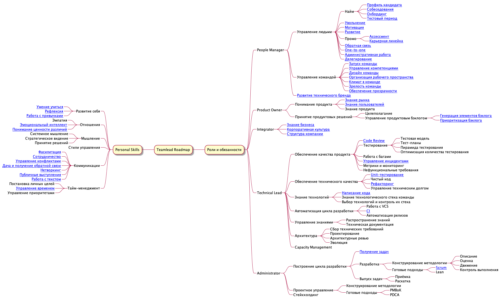

> Team Lead is a ❄️, because in each company they are unique and distinct.

- [Roadmap](#roadmap)

# What is it about?

The concepts of "Team Lead", "Tech Lead", "Tech Manager" and others are very stretchy. Companies solve different tasks, these roles have different responsibilities. Besides, various leadership styles, differences in personal skills, and much more are put in the picture. But isn't that what happens to the developers? Different companies, different tasks, again, different nature of tasks and responsibilities.

We interviewed several dozen large and small companies, found out what they expect from Team Leads and how they interact with them. As a result, we were able to form a single model of basic teamwork competencies that covers all the cases studied.

This model can be used in any way you like - to come up with your development plan, to define duties and responsibilities, to write a job description or to conduct interviews. Keep in mind it is likely you don't need all the branches of potential development - and this is fine.

> 🚨 **Important:** Depending on a company, the Team Lead needs to work on different branches and responsibilities. We don't think that the goal should be to develop all the areas of the roadmap. It's important to focus on the problems and needs of your workplace, first of all.

The work is still in progress, so feel free to publish an Issue or open a Pull Request.

# How to use it?
## 🏫 For a company
1. Download the [MindMap](https://cdn.jsdelivr.net/gh/tlbootcamp/tlroadmap@master/roadmap.mm)(Russian-only for now) with the full Team Lead model.
2. Go through all branches of the Team Lead responsibilities. Remove those that are not required by your company or are already being performed by someone else.
3. Form from the resulting map the artifacts you need: a profile to hire, a description of role expectations, a development plan.
4. Use our knowledge base to go deeper into any of the branches. For each of the branches we describe in detail its meaning, motivation to use, examples of good and bad behavior, ways of development in practice and theory.

## 👩🏼‍💻 For yourself
1. Download the [MindMap](https://cdn.jsdelivr.net/gh/tlbootcamp/tlroadmap@master/roadmap.mm)(Russian-only for now) with the full Team Lead model.
2. Mark on it the competencies you already have and those you need for further growth within the company. To give you a hint, look at what your manager or colleagues are doing. If there are still some difficulties, feel free to ask a question in Issues.
3. Make a list of competencies that separate your current profile and your target profile.
4. Using our knowledge base, create a development plan for each of the competencies, which includes both theory and practical application.
5. Show your development plan to your manager and ask for assistance.

# Roadmap

The roadmap consists of two sections:
- **Roles and responsibilities.** A list of high-level work roles and more specific responsibilities.
- **Personal Skills.** Personal skills and qualities that are necessary for certain roles and responsibilities.

Each of the map's leaves will eventually become a large entry in the knowledge base with a description, examples of behavior, and ways to develop the skill.

## Download roadmap
- [PNG](https://cdn.jsdelivr.net/gh/tlbootcamp/tlroadmap@master/roadmap.png)
- [Mindmap](https://cdn.jsdelivr.net/gh/tlbootcamp/tlroadmap@master/roadmap.mm)

The easiest way to open a `mm` file is to use [Freemind](https://sourceforge.net/projects/freemind/) (free and simple), [MindNode](https://mindnode.com/) (expensive and premium) or [MindMeister](https://mindmeister.com) (freemium and online). Other MindMap editors are also likely to work, but we haven't tested them.

## Examples of use
We've prepared a few common Team Lead models. With their help, you can see how to work with the roadmap, or you can just bring them to your company as examples:
- Playing coach in a scrum team: [mindmap](https://cdn.jsdelivr.net/gh/tlbootcamp/tlroadmap@master/examples/playing-coach.mm)
- Technical Lead: [mindmap](https://cdn.jsdelivr.net/gh/tlbootcamp/tlroadmap@master/examples/techlead.mm)
- Startup Team Lead: [mindmap](https://cdn.jsdelivr.net/gh/tlbootcamp/tlroadmap@master/examples/startup-teamlead.mm)

# Work in progress
The current roadmap is an alpha version that has a common teamwork structure and partially describes the first major role, Resource Manager. We are looking forward to your participation in the project. The contribution process is described in depth in [`CONTRIBUTING.md`](/contributing).

# The knowledge base
The base is gradually filled with Stas Tsyganov, Egor Tolstoy and the community. Our final goal is to describe each of the directions according to the following template:
- Description (what we are talking about)
- Why this branch is important
- What happens if you don't work on it
- To whom it can be delegated
- Examples of good and bad behavior
- Development techniques: skills, practices, consulting, theory

If you don't agree with any of the existing descriptions or think you can improve it, feel free to send your pull request. If you have any questions about the structure itself, you are welcome to join [our chat room, RU](https://tlinks.run/tlbootcamp) or discuss it directly via a pull request.

<!--roadmap.mm table of contents begin-->
## Roles and responsibilities

### Resource Manager
- Human management
    - Hiring
        - [Candidate profile](../tlroadmap/old/resource-manager/profile.md)
        - [Interviews](../tlroadmap/old/resource-manager/interview.md)
        - [Onboarding](../tlroadmap/old/resource-manager/onboarding.md)
        - [Probation](../tlroadmap/old/resource-manager/test-period.md)
    - [Firing](../tlroadmap/old/resource-manager/firing.md)
    - [Motivation](../tlroadmap/old/resource-manager/motivation.md)
    - [Development](../tlroadmap/old/resource-manager/development.md)
    - Promotion
        - [Assessments](../tlroadmap/old/resource-manager/assessment.md)
        - [Career path](../tlroadmap/old/resource-manager/career.md)
    - [Feedback](../tlroadmap/old/resource-manager/feedback.md)
    - [One-to-one](../tlroadmap/old/resource-manager/one-to-one.md)
    - [Administrative tasks](../tlroadmap/old/resource-manager/admin.md)
- Team management
    - [Creating a team](../tlroadmap/old/resource-manager/team-launch.md)
    - [Competency management](../tlroadmap/old/resource-manager/competency-management.md)
    - [Team design](../tlroadmap/old/resource-manager/team-design.md)
    - [Workspace organization](../tlroadmap/old/resource-manager/workspace.md)
    - [Team spirit](../tlroadmap/old/resource-manager/team-climate.md)
    - [Team maturity](../tlroadmap/old/resource-manager/team-maturity.md)
    - [Transparency](../tlroadmap/old/resource-manager/transparency.md)
- [Technical Brand Development](../tlroadmap/old/resource-manager/techpr.md)

### Product Owner
- Product understanding
    - Market knowledge
        - Competitors
        - State
        - Market specifics
    - Product knowledge
        - Product Vision
        - Product Strategy
        - Product Metrics
        - Value streams
    - User knowledge
        - Target audience
        - User pains
- Making product decisions
    - Target setting
        - The goal-setting process
        - Ready-made approaches
    - Product backlog management
        - Backlog element generation
        - Backlog prioritization

### Integrator
- [Business knowledge](../tlroadmap/roles/integrator/business-knowledge.md)
- [Corporate culture](../tlroadmap/roles/integrator/corporate-culture.md)
- Company structure

### Technical Lead
- Product quality assurance
    - [Code Review](../tlroadmap/roles/technical-lead/product-quality/code-review.md)
    - Testing
        - Test model
        - Test plans
        - The Pyramid of testing
        - Optimizing the amount of testing
    - Work on bugs
    - Incident management
    - Metrics and monitoring
    - Non-functional requirements
- Technical quality assurance
    - Unit tests
    - Pure code
    - Refactoring
    - Technical Debt Management
- Technology knowledge
    - Writing code
    - Technological stack
    - Selecting technologies and control of their stack
- Development cycle automation
    - VCS
    - CI
    - Release Automation
- Knowledge management
    - Knowledge sharing
    - Technical documentation
- Architecture
    - Technical requirements elicitation
    - Design
    - Architectural Reviews
    - Evolution
- Capacity Management

### Administrator
- Building the development cycle
    - Getting tasks
    - Development
        - Methodology design
            - Description
            - Evaluation
            - Execution
            - Control of execution
        - Ready-made approaches
            - Scrum
            - Lean
    - Issue of tasks
        - Acceptance
        - Rolling out
- Project management
    - Methodology design
    - Ready-made approaches
        - PMBoK
        - PDCA
- Stakeholder

## Personal Skills

#### Self development
- Ability to learn
- Reflexion
- Making habits

#### Relationships
- Empathy
- Emotional intelligence
- Understanding the value of differences

### Thinking
- Systemic thinking
- Strategic vision
- Decision-making

#### The control styles

### Communication
- [Facilitation](../tlroadmap/communications/facilitation.md)
- Cooperation
- Conflict management
- Giving and receiving feedback
- Networking
- Public appearances
- Working with text

### Time-management
- Setting personal goals
- [Time management](../tlroadmap/personal-skills/time-management/time-management.md)
- Priority management
<!--roadmap.mm table of contents end-->

# Acknowledgements
The following people contributed to the development of the map: Anatoly Panov, Roman Ivliev, Nikolay Krapivny, Georgy Mogelashvili, Yulia Rakhmanova, Nikolay Balakirev, Alexander Minenok, Pavel Antonov, Vitaly Sharovatov, Alexander Svetkin, Marat Chukmarov.

### Translation notes
Translated doc version: [commit](https://github.com/tlbootcamp/tlroadmap/commit/fe73f23a0ff29514ef4b145740fe9fc729a235fa)

